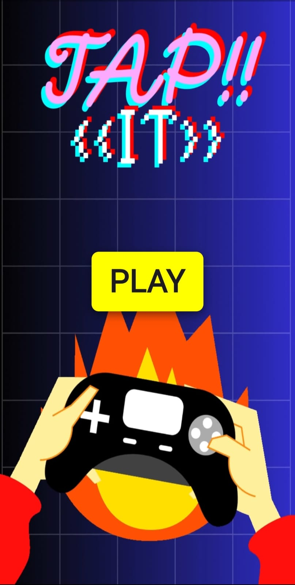
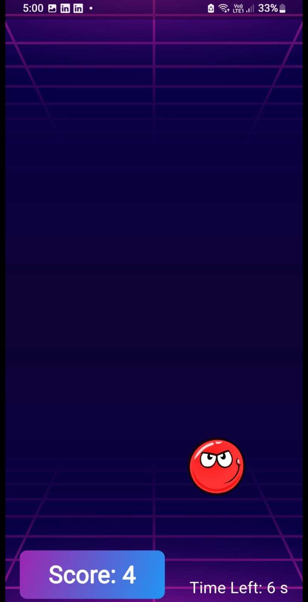
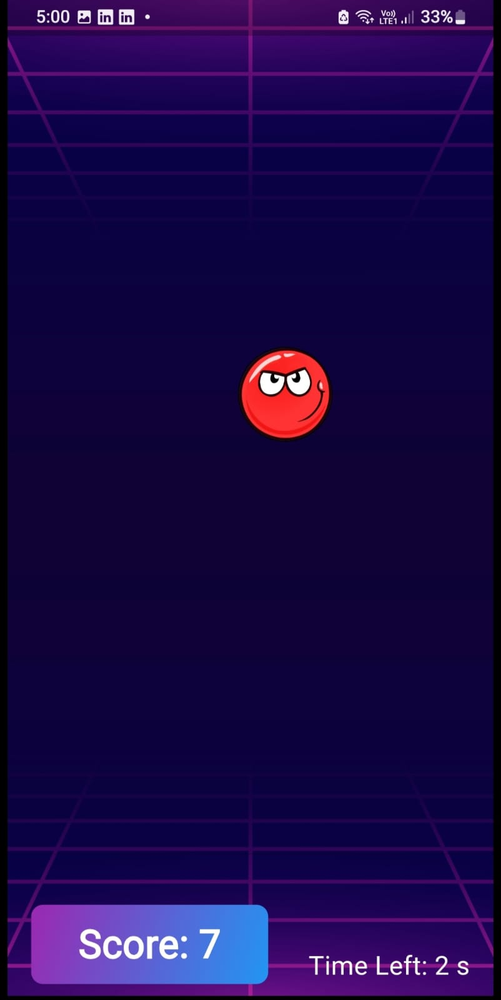
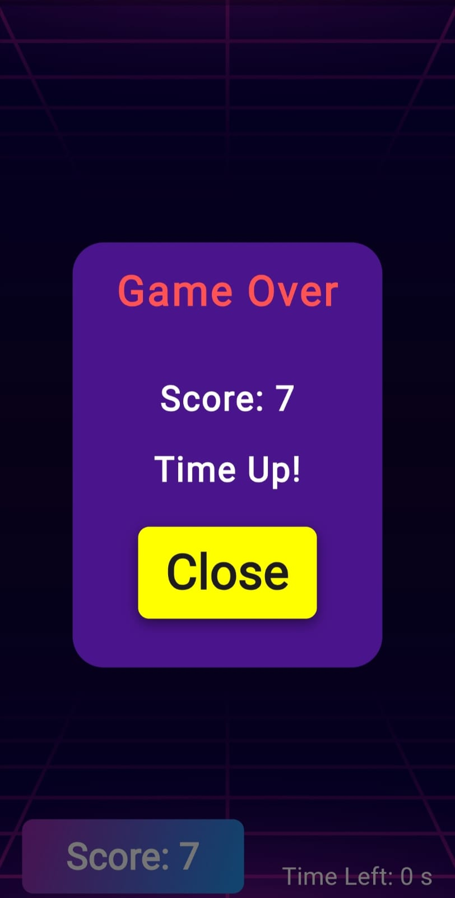

# Tappi

A fun and engaging tapping game built with Flutter. Challenge yourself to tap on the dot as it appears randomly on the screen within a selected time limit. Enjoy a visually appealing game with animated interactions and a customizable gameplay experience.

## Features

- **Dynamic Gameplay**: Tap the dot that appears at random positions to score points.
- **Customizable Time Limits**: Choose from various time options to set the duration of the game.
- **Animated UI**: Includes smooth animations for button interactions and dot movements.
- **Background Video**: An immersive video background enhances the gaming experience.
- **Visual Enhancements**: Attractive gradients, game-themed buttons, and animated transitions.

## Screenshots
Here are some screenshots of the game:

- **Start Screen**:
  

- **In-Game**:
  
   

- **Game Over Screen**:
  

## Getting Started

To run this project locally, follow these steps:

1. **Clone the Repository**:
   ```bash
   git clone https://github.com/nikhil2004-blip/tappi.git
